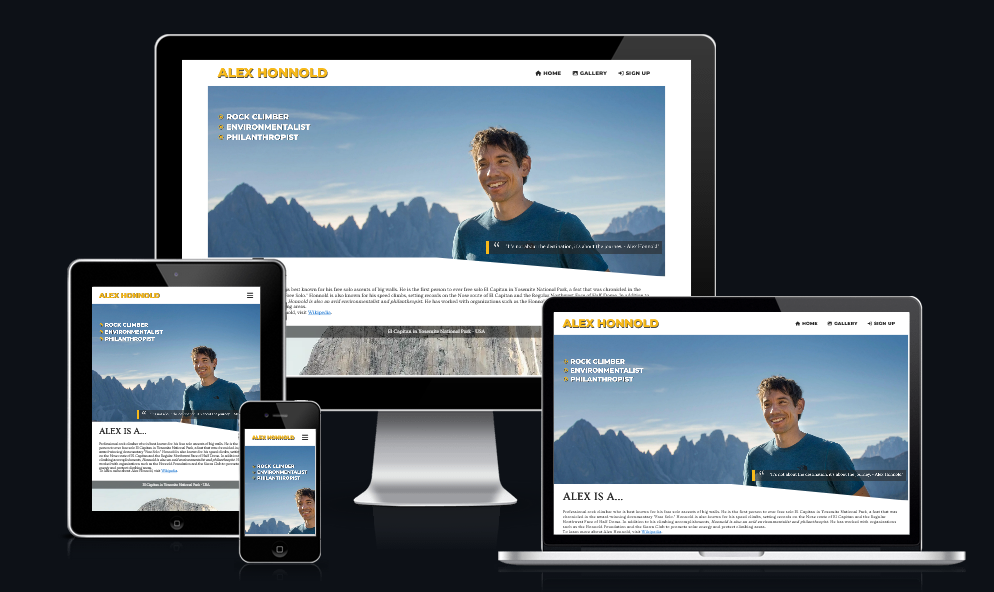
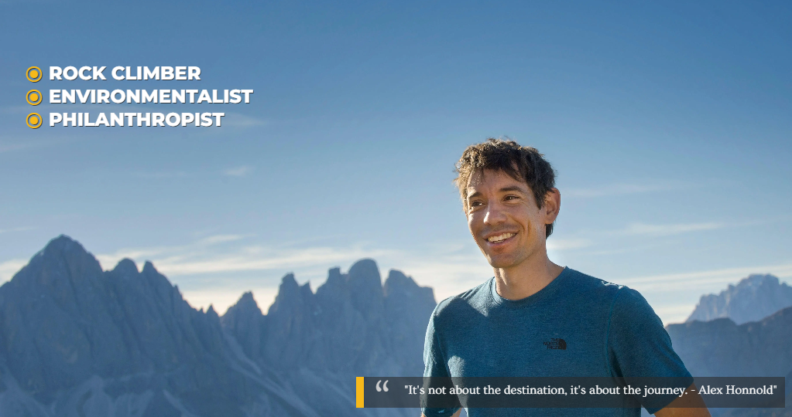
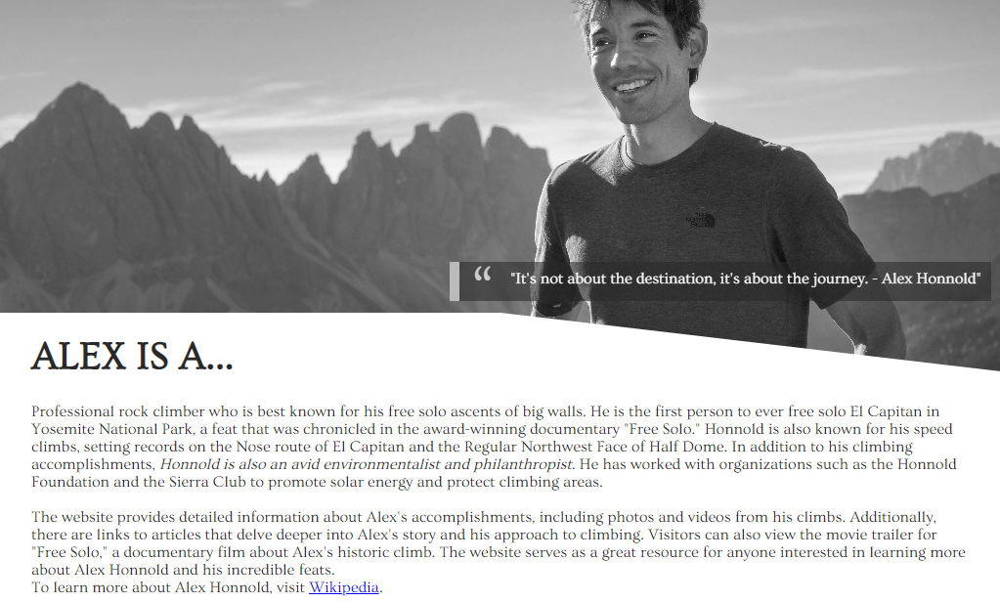
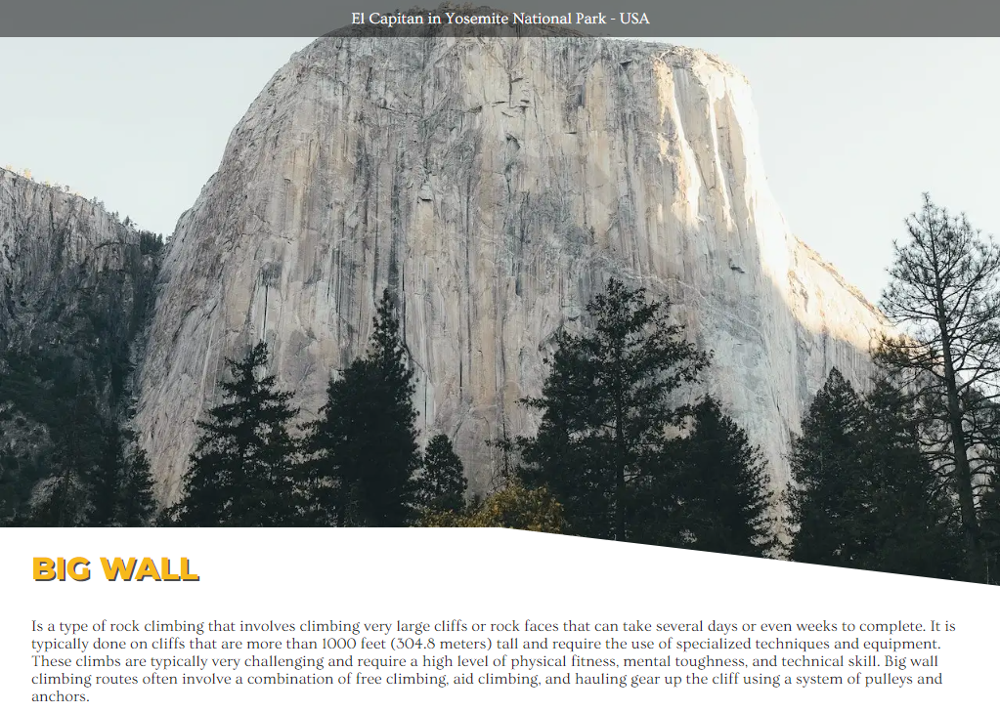
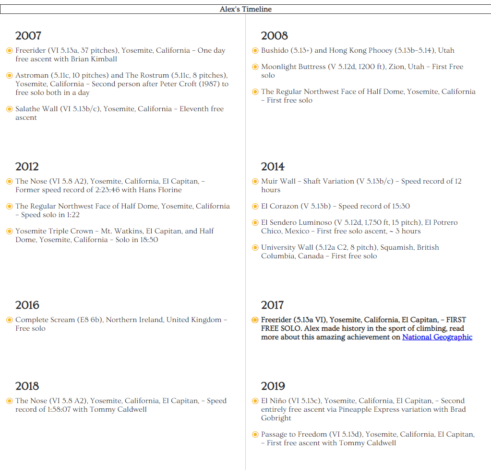
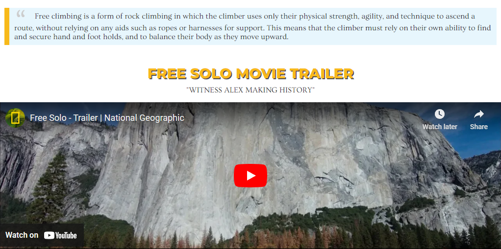
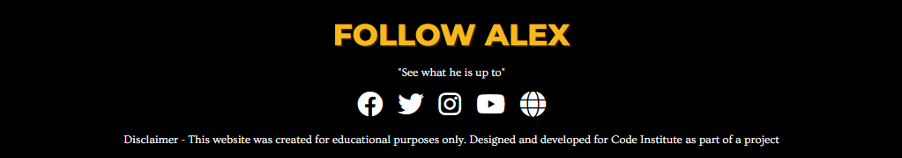
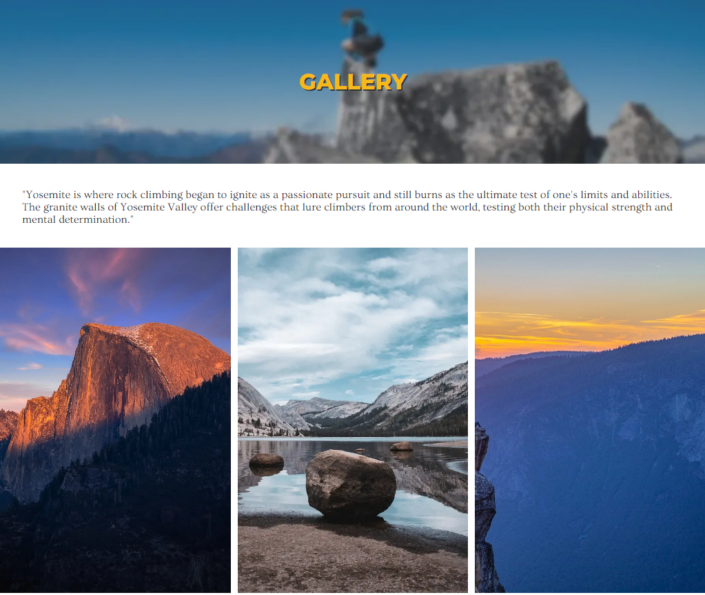
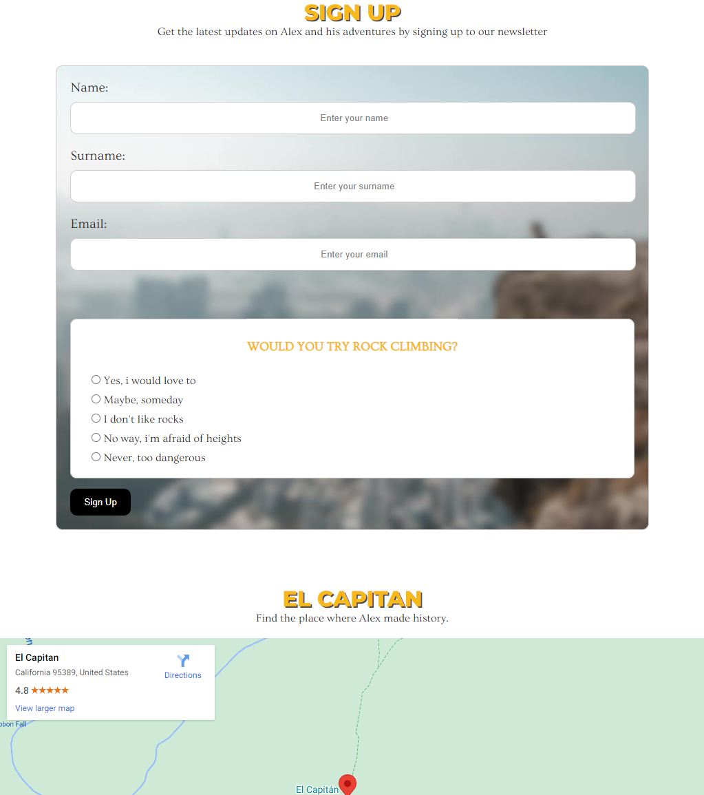

# Alex Honnold

## Designed by:
Karolis Petrauskas

Alex Honnold is a professional rock climber known for his free solo ascents of big walls. He has completed many notable climbs, including the first free solo ascent of El Capitan in Yosemite National Park. He has also written a book, "Alone on the Wall," and has been featured in several documentaries, including "Free Solo," which won an Academy Award.

## Features 

This website is primarily for fans and enthusiasts of rock climbing, particularly those who are interested in free solo climbing and big wall ascents. The website offers information about Alex's climbs and expeditions, including detailed accounts and photos of his notable ascent on El Capitan. Additionally, the website includes a Gallery where Alex spends his days training for his next big free solo climb. The website also provides a sign up section where users can sign up and receive newsletter about Ale's journey. Overall, the website is for anyone who is interested in learning more about Alex Honnold and his climbing accomplishments, and who wants to gain inspiration and insights into the world of climbing.

### Existing Features

- __Navigation Bars__

  - Simple and minimalistic design for easy navigation. Featured on all three pages, includes links to Home, Gallery and Sign up.
  - This section will facilitate smooth navigation between pages on any device, eliminating the need to use the "back" button to return to previous pages.

- __Tablet__

  - The Navigation Bar, which is a component of the user interface on tablets, includes a feature known as the Burger Menu. This menu option is designed to improve the overall user experience by making navigation more convenient and seamless. The Burger Menu is a button that, when clicked, opens a menu with a list of options that allows users to quickly and easily access different sections or pages within the tablet's interface. This feature is intended to make it simpler for users to navigate the tablet, and to make it easier for them to find the information or content they are looking for. By providing a clear and intuitive way to access different parts of the tablet's interface, the Burger Menu aims to enhance the overall usability of the device.

- __Mobile__

  - The Navigation Bar for mobile devices is designed to be responsive, meaning it adjusts to fit the size and resolution of the device it is being viewed on. This allows for optimal user experience and accessibility, as the navigation options are always easily accessible and visible, regardless of the size of the device being used. This feature ensures that users can navigate the website with ease and convenience while on mobile.

- __The landing page image__
  
  - The landing page displays a portrait of Alex, accompanied by a list of the top 3 fields in which he is participating, as well as an inspiring quote.
  - To enhance the user experience, the image features a grayscale scrolling effect that highlights the upcoming "About" section.

- __About section__

  - The About section of the page is a brief introduction to Alex Honnold, providing an overview of his background and accomplishments as a world-renowned rock climber. This section aims to pique the interest of visitors and encourage them to scroll down for more information.
  - To improve the user experience, the grayscale effect of the image becomes more prominent as the user scrolls down the page. Also the image cut effect can be seen to showcase the beautiful web design.

- __Image caption section__

  - The Image Caption section on the page includes a caption that describes the image being displayed. Additionally, it includes a heading with accompanying text that explains the concept of big wall climbing.
  - This section aims to give visitors a comprehensive understanding of the sport and the significance of the image being displayed. It also serves as an educational resource for those who are unfamiliar with the sport but are interested in learning more.

- __Timeline section__

  - The Timeline section of the page presents a chronological overview of some of Alex's most notable achievements in rock climbing. The section highlights key moments in his career, and it also specifically showcases the historic free solo ascent of El Capitan in 2017. This event is presented with a clickable link to Wikipedia, which allows users to learn more about the climb and its significance in the climbing community.
  - The section is designed in a responsive way so that it adjusts to mobile devices, changing to a one-column layout to improve the user experience. The section is an interactive and engaging way to showcase Alex's accomplishments, and it also serves as a great way to learn more about his journey as a climber.

- __Movie trailer section__

  - The Movie Trailer section on the page is dedicated to the Academy Award-winning documentary film "Free Solo" which chronicles Alex Honnold's historic free solo ascent of El Capitan. The section features a quote that explains the concept of free climbing, which is climbing without the use of ropes or other safety equipment. The quote sets the context for the film and provides an understanding of the level of difficulty and the risks involved in the climb.
  - This section allows visitors to learn more about the climb and the film and also provides a way for them to watch the trailer, which is an inspiring and a thrilling watch.

 

- __The Footer__ 

  - The Footer section of the page includes a heading that directs visitors to the social media accounts of Alex Honnold, where they can learn more about Alex's climbing adventures and connect with him. 
  - The social media links have a hover effect that complements the overall color scheme of the website, making it easy for users to identify and interact with.
  - At the very bottom of the footer, there's a disclaimer that provides legal information about the website and its content.

- __Gallery__

  - The Gallery page includes a heading with a blurred background that serves as an indicator that the user is currently on that page accompanied by brief text that provides context and information about the images that are being showcased.
  - A total of 12 images are designed to be responsive, which means they automatically adjust to different screen sizes. On larger screens, the images are displayed in 3 columns, while on smaller screens, they collapse to 2 columns and 1 column, providing a better user experience. This design ensures that the images are easily viewable regardless of the device being used, making it easy for visitors to explore the gallery.

- __The Sign Up Page__

  - The form allows visitors to subscribe to a newsletter to stay up-to-date with the latest news and updates about Alex Honnold.
  - Additionally, there is a fun survey that is designed to engage users and learn more about their interests. The survey is optional and is not required to sign up for the newsletter.
  - Below the form, there's a map that shows the location of El Capitan, which is the site of Alex's historic free solo ascent. This map serves as a visual reference for users and provides a sense of the scale and location of the climb.

### Future Features

- Add Error 404 page with back to home link
  - A 404 error page is used to indicate that a requested page or resource could not be found on a website. Implementing a custom 404 error page can be useful for a number of reasons, such as providing a better user experience by giving the user more information about what went wrong, and helping to reduce the number of "bounced" visitors by keeping them engaged on the website.
- Add Scroll to top for better user expierence.
  - A "Scroll to Top" button on a website can provide a number of benefits for users such as improved navigation, increased accessibility, better user experience, better analytics, and better SEO. It allows users to quickly jump back to the top of the page and can help to improve the overall user experience and website performance.
- Update the website for Alex's future achievements

# Technologies Used

* [HTML5](https://html.spec.whatwg.org/) - provides the content and structure for the website.
* [CSS](https://www.w3.org/Style/CSS/Overview.en.html) - provides the styling.
* [JavaScript](https://developer.mozilla.org/en-US/docs/Web/JavaScript) - provides the styling.
* [Balsamiq](https://balsamiq.com/wireframes/) - used to create the wireframes.
* [Gitpod](https://www.gitpod.io/#get-started) - used to deploy the website.
* [Github](https://github.com/) - used to host and edit the website.

# Testing 

text

### Validator Testing 

- HTML
  - No errors were returned when passing through the official [W3C validator]()
- CSS
  - No errors were found when passing through the official [(Jigsaw) validator]()

### Unfixed Bugs

text 

## Deployment

- The site was deployed to GitHub pages. The steps to deploy are as follows: 
  - In the GitHub repository, navigate to the Settings tab 
  - From the source section drop-down menu, select the Master Branch
  - Once the master branch has been selected, the page will be automatically refreshed with a detailed ribbon display to indicate the successful deployment. 

The live link can be found here - https://kpetrauskas92.github.io/alex-honnold-p1 

## Credits 

text

### Content 

Text

### Media

- The photos used on the home and sign up page are from This Open Source site
- The images used for the gallery page were taken from this other open source site

