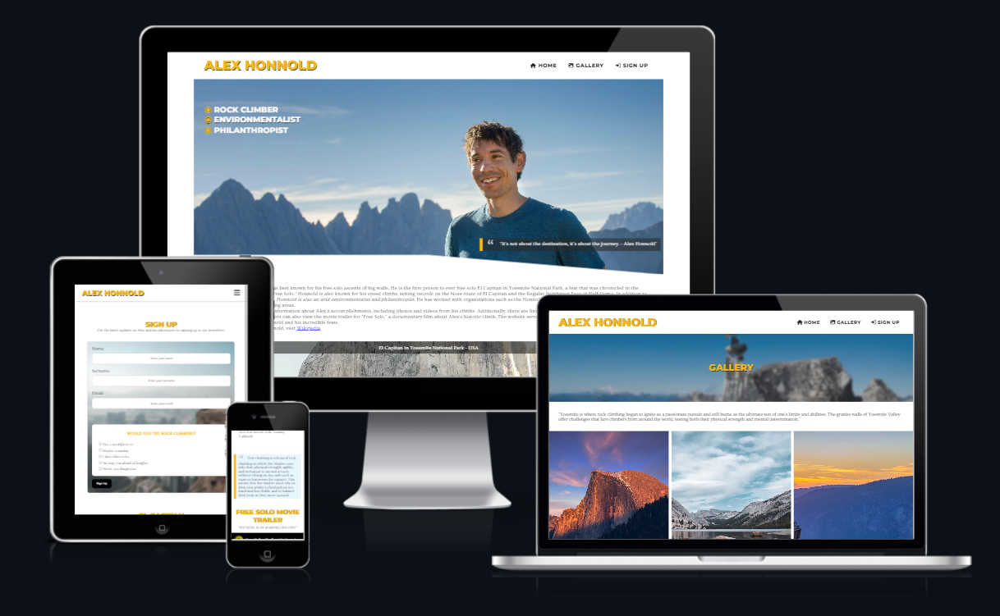

# Alex Honnold - From Yosemite to the world.

## Porfolio 1

Alex Honnold is a professional rock climber known for his free solo ascents of big walls. He has completed many notable climbs, including the first free solo ascent of El Capitan in Yosemite National Park. He has also written a book, "Alone on the Wall," and has been featured in several documentaries, including "Free Solo," which won an Academy Award.

# Contents

* [**User Experience UX**](<#user-experience-ux>)
    * [Wireframes](<#wireframes>)
    * [Site Structure](<#site-structure>)
    * [Design Choices](<#design-choices>)
    * [Typography](<#typography>)
    * [Colour Scheme](<#colour-scheme>)
* [**Features**](<#features>)
    * [**Home**](<#home>)
        * [Navigation Menu](<#navigation>)
        * [Navigation Tablet](<#tablet>)
        * [Navigation Mobile](<#mobile>)
        * [Hero Image Section](<#hero-image-section>)
        * [About Section](<#about-section>)
        * [Caption Image Section](<#about-us>)
        * [Timeline Section](<#timeline-section>)
        * [Movie Trailer Section](<#movie-trailer-section>)
        * [Footer](<#footer>)
    * [**Gallery**](<#gallery>)
    * [**Sign up**](<#sign-up>)
    * [**Thank you**](<#thank-you-page>)
    * [**Future Features**](<#future-features>)
* [**Technologies Used**](<#technologies-used>)
* [**Testing**](<#testing>)
* [**Deployment**](<#deployment>)
* [**Credits**](<#credits>)
    * [**Content**](<#content>)
    * [**Media**](<#media>)
*  [**Acknowledgements**](<#acknowledgements>)

# User Experience (UX)

[Back to top](<#contents>)

## Wireframes

The wireframes for the website were produced in [Balsamiq](https://balsamiq.com). There are frames for a full width display and a small mobile device. The final site varies slightly from the wireframes due to developments that occured during the creation process. 

 

[Back to top](<#contents>)

## Site Structure

The website has three pages. The [home page](index.html) is the default loading page, [gallery](gallery.html) and [sign up](sign-up.html) pages are all accessible primarily from the navigation menu. There is another page called [thank you](thank-you.html) that users only see when they submit a form query.

[Back to top](<#contents>)
## Design Choices

 * ### Typography
    The fonts chosen were 'Monsterrat' for the headings and 'Ovo' for the body text. They fall back to sans-serif respectively. 
    *  'Monsterrat' was chosen for the headings to give the user an inital welcoming feel.
    *  'Ovo' is used for the body text as it goes along nicely with the headings whilst     being easy to read for all.

 * ### Colour Scheme
      The colour scheme eventually chosen is one based on gold, black and grey. The colour contrasts with the blue sky colour in many of the images. Yellow traditionally gives the impression of achievement, accomplishment and triumph. Users visiting the website should sense the feeling of extroadinary.

[Back to top](<#contents>)

## Features 

This website is primarily for fans and enthusiasts of rock climbing, particularly those who are interested in free solo climbing and big wall ascents. The website offers information about Alex's climbs and expeditions, including detailed accounts and photos of his notable ascent on El Capitan. Additionally, the website includes a Gallery where Alex spends his days training for his next big free solo climb. The website also provides a sign up section where users can sign up and receive newsletter about Alex's journey. Overall, the website is for anyone who is interested in learning more about Alex Honnold and his climbing accomplishments, and who wants to gain inspiration and insights into the world of climbing.

# Home

## Existing Features

### Navigation

  - Simple and minimalistic design for easy navigation. Featured on all three pages, includes links to Home, Gallery and Sign up.
  - This section will facilitate smooth navigation between pages on any device, eliminating the need to use the "back" button to return to previous pages.

[Back to top](<#contents>)

### Tablet

  - The Navigation Bar on tablets has a feature called the Burger Menu. It makes navigation easier and more convenient for users. It's a button that opens a menu with options for quickly accessing different parts of the tablet's interface. The goal is to make it simpler for users to navigate and find what they need.

[Back to top](<#contents>)

### Mobile

  - The Navigation Bar for mobile devices is designed to be responsive, meaning it adjusts to fit the size and resolution of the device it is being viewed on. This allows for optimal user experience and accessibility, as the navigation options are always easily accessible and visible, regardless of the size of the device being used. This feature ensures that users can navigate the website with ease and convenience while on mobile.

[Back to top](<#contents>)

## Hero Image Section
  
  - The landing page displays a portrait of Alex, accompanied by a list of the top 3 fields in which he is participating in, as well as an inspiring quote.
  - To enhance the user experience, the image features a grayscale scrolling effect that highlights the upcoming "About" section.

[Back to top](<#contents>)

## About Section

  - The About section of the page is a brief introduction to Alex Honnold, providing an overview of his background and accomplishments as a world-renowned rock climber. This section aims to pique the interest of visitors and encourage them to scroll down for more information.
  - To improve the user experience, the grayscale effect of the image becomes more prominent as the user scrolls down the page. Also the image cut effect can be seen to showcase the beautiful web design.

[Back to top](<#contents>)

## Image Caption Section

  - The Image Caption section on the page includes a caption that describes the image being displayed. Additionally, it includes a heading with accompanying text that explains the concept of big wall climbing.
  - This section aims to give visitors a comprehensive understanding of the sport and the significance of the image being displayed. It also serves as an educational resource for those who are unfamiliar with the sport but are interested in learning more.

[Back to top](<#contents>)

## Timeline Section

  - The Timeline section of the page presents a chronological overview of some of Alex's most notable achievements in rock climbing. The section highlights key moments in his career, and it also specifically showcases the historic free solo ascent of El Capitan in 2017. This event is presented with a clickable link to Wikipedia, which allows users to learn more about the climb and its significance in the climbing community.
  - The section is designed in a responsive way so that it adjusts to mobile devices, changing to a one-column layout to improve the user experience. The section is an interactive and engaging way to showcase Alex's accomplishments, and it also serves as a great way to learn more about his journey as a climber.

[Back to top](<#contents>)

## Movie trailer Section

  - The Movie Trailer section on the page is dedicated to the Academy Award-winning documentary film "Free Solo" which chronicles Alex Honnold's historic free solo ascent of El Capitan. The section features a quote that explains the concept of free climbing, which is climbing without the use of ropes or other safety equipment. The quote sets the context for the film and provides an understanding of the level of difficulty and the risks involved in the climb.
  - This section allows visitors to learn more about the climb and the film and also provides a way for them to watch the trailer, which is an inspiring and a thrilling watch.

 

 [Back to top](<#contents>)

## The Footer

  - The Footer section of the page includes a heading that directs visitors to the social media accounts of Alex Honnold, where they can learn more about Alex's climbing adventures and connect with him. 
  - The social media links have a hover effect that complements the overall color scheme of the website, making it easy for users to identify and interact with.
  - At the very bottom of the footer, there's a disclaimer that provides legal information about the website and its content.

[Back to top](<#contents>)

## Gallery

  - The Gallery page includes a heading with a blurred background that serves as an indicator that the user is currently on that page accompanied by brief text that provides context and information about the images that are being showcased.
  - A total of 12 images are designed to be responsive, which means they automatically adjust to different screen sizes. On larger screens, the images are displayed in 3 columns, while on smaller screens, they collapse to 2 columns and 1 column, providing a better user experience. This design ensures that the images are easily viewable regardless of the device being used, making it easy for visitors to explore the gallery.

[Back to top](<#contents>)

## The Sign Up Page

  - The form allows visitors to subscribe to a newsletter to stay up-to-date with the latest news and updates about Alex Honnold.
  - Additionally, there is a fun survey that is designed to engage users and learn more about their interests. The survey is optional and is not required to sign up for the newsletter.
  - Below the form, there's a map that shows the location of El Capitan, which is the site of Alex's historic free solo ascent. This map serves as a visual reference for users and provides a sense of the scale and location of the climb.

[Back to top](<#contents>)

## Thank You Page

  - A thank you page is a webpage that is presented to the user after they have submitted a query on the sign-up page. This keeps the user on the website and avoids the need for them to navigate away. The page usually includes a message of appreciation for the user's action.

[Back to top](<#contents>)

### Future Features

- Add Error 404 page with back to home link
  - A 404 error page is used to indicate that a requested page or resource could not be found on a website. Implementing a custom 404 error page can be useful for a number of reasons, such as providing a better user experience by giving the user more information about what went wrong, and helping to reduce the number of "bounced" visitors by keeping them engaged on the website.
- Add Scroll to top for better user expierence.
  - A "Scroll to Top" button on a website can provide a number of benefits for users such as improved navigation, increased accessibility, better user experience, better analytics, and better SEO. It allows users to quickly jump back to the top of the page and can help to improve the overall user experience and website performance.
- Update the website for Alex's future achievements

[Back to top](<#contents>)

# Technologies Used

* [HTML5](https://html.spec.whatwg.org/) - provides the content and structure for the website.
* [CSS](https://www.w3.org/Style/CSS/Overview.en.html) - provides the styling.
* [JavaScript](https://developer.mozilla.org/en-US/docs/Web/JavaScript) - provides the function.
* [Balsamiq](https://balsamiq.com/wireframes/) - used to create the wireframes.
* [Gitpod](https://www.gitpod.io/#get-started) - used to deploy the website.
* [Github](https://github.com/) - used to host and edit the website.
* [Photoshop](https://https://www.adobe.com/ie/products/photoshop.html.com/) - used to edit images.

[Back to top](<#contents>)

# Testing 

Please refer to [**_here_**](TESTING.md) for more information on testing.

[Back to top](<#contents>)

## Deployment

- The site was deployed to GitHub pages. The steps to deploy are as follows:
1. In the GitHub repository, navigate to the **Settings** tab.
2. Once in Settings, navigate to the **Pages** tab on the left hand side.
3. Under **Source**, select the branch to **master**, then click **save**.
4. Once the master branch has been selected, the page will be automatically refreshed with a detailed ribbon display to indicate the successful deployment. 

 

The live link can be found here - https://kpetrauskas92.github.io/alex-honnold-p1

[Back to top](<#contents>)

### **To fork the repository on GitHub**

- A copy of the GitHub Repository can be made by forking the GitHub account. This copy can be viewed and changes can be made to the copy without affecting the original repository. Take the following steps to fork the repository;
1. Log in to **GitHub** and locate the [repository](https://github.com/kpetrauskas92/alex-honnold-p1).
2. On the right hand side of the page inline with the repository name is a button called **'Fork'**, click on the button to create a copy of the original repository in your GitHub Account.

[Back to top](<#contents>)

### **To create a local clone of this project**

- The method from cloning a project from GitHub is below:
1. Under the repository’s name, click on the **code** tab.
2. In the **Clone with HTTPS** section, click on the clipboard icon to copy the given URL.
3. In your IDE of choice, open **Git Bash**.
4. Change the current working directory to the location where you want the cloned directory to be made.
5. Type **git clone**, and then paste the URL copied from GitHub.
6. Press **enter** and the local clone will be created.

[Back to top](<#contents>)

# Credits
### Content

* [Google Fonts](https://fonts.google.com/) Used for fonts.
* [Google Maps](https://www.google.com/maps) Used for maps.
* [YouTube](http://youtube.com/) Used for video.
* [Font Awesome](https://fontawesome.com/). Used for icons.
* [TinyPNG](https://tinypng.com/). Used to compress images.
* [Free Convert](https://www.freeconvert.com/jpg-to-webp/). Used to convert image formats.
* [Colormind](http://colormind.io/) Used to generate color pallete
* [Dev.to](https://dev.to/devggaurav/let-s-build-a-responsive-navbar-and-hamburger-menu-using-html-css-and-javascript-4gci/) Idea used for burger menu.
* [CSSPortal](https://www.cssportal.com/css-clip-path-generator/) Idea for image clip path.
* [Javascript.info](https://javascript.info/onscroll) Idea used for grayscale effect on scroll.
* [Reame.md](https://github.com/EwanColquhoun/wawaswoods/blob/master/README.md) Some ideas taken

[Back to top](<#contents>)

### Media
* Hero banner image used, and licence obtained from [Alamy](https://www.alamy.com/portrait-of-alex-honnold-the-strongest-free-solo-climbers-image342625769.html).
* All other images from [Pexels](https://www.pexels.com/).

[Back to top](<#contents>)

# Acknowledgements
The website was developed and designed as a Portfolio 1 Project for Full Stack Software Developer Diploma course at the [Code Institute](https://codeinstitute.net/). I would like to thank my mentor [Precious Ijege](https://www.linkedin.com/in/precious-ijege-908a00168/), the Slack community, and all at the Code Institute for their help and support. I really enjoyed working on this project as i've great interest in mountaineering and rock climbing which the website is about.

Karolis Petrauskas 2023.

[Back to top](<#contents>)