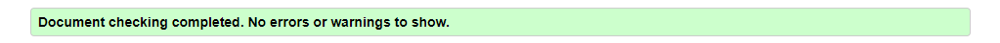
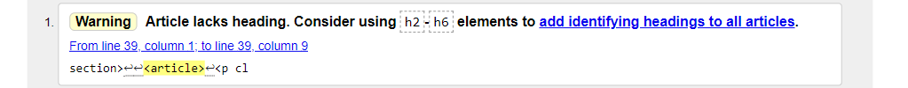
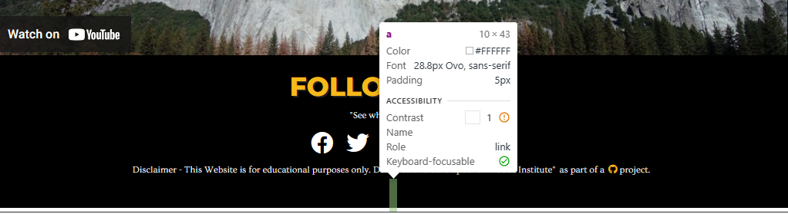

# Testing
## Code Validation
The Alex Honnold website has been throughly tested. All the code has been run through the [W3C html Validator](https://validator.w3.org/) and the [W3C CSS Validator](https://jigsaw.w3.org/css-validator/). No error were found after the last test.

The HTML validator results for each page are below:

* Home page

* Gallery page

* Sign Up page

* Thank you page

The CSS validator results are below:

## Responsiveness Test

* The responsive design tests were carried out manually with [Google Chrome DevTools](https://developer.chrome.com/docs/devtools/) and [Responsive Design Checker](https://www.responsivedesignchecker.com/).

|        | Moto G4 | Galaxy S5 | iPhone 5 | iPad | iPad Pro | Display <1200px | Display >1200px |
|--------|---------|-----------|----------|------|----------|-----------------|-----------------|
| Render | pass    | pass      | pass     | pass | pass     | pass            | pass            |
| Images | pass    | pass      | pass     | pass | pass     | pass            | pass            |
| Links  | pass    | pass      | pass     | pass | pass     | pass            | pass            |

Note: On wide display types the contents of the site are restricted in width to 1440px. This helps the UX by not spreading the content too wide on the extra wide screens.

## Browser Compatibility

The website was tested on the following browsers with no visible issues for the user. 
Google Chrome, Microsoft Edge, Safari and Mozilla Firefox. Appearance, functionality and responsiveness were consistent throughout for a range of device sizes and browsers.

## Known Bugs
* ### Resolved

    * During HTML validation on gallery.html one bug became known, a brief description is below:
    
    This was an oversight from the development on semantics when the \<article> attribute was used without a heading. It was easily fixed by deleting the tag, and leaving it as a paragraph \
 only.

    * At the end of testing a bug appeared to cause a gap between the footer and the border of the page at the bottom 
    
    This was an oversight from the development phase when the footer disclaimer was being updated with links. It was easily fixed by closing the a href attribute with \</a>. The link was showing as having another link because it was not properly closed as it also has an \<i> attribute for icon.

* ### Unresolved

    * During the testing of responsiveness in different browsers a bug was found that did not display "Font Awesome" icons on Ipads on the nav bar. 
    
    
    

## Additional Testing
### Lighthouse

The site was also tested using [Page Speed Insights](https://pagespeed.web.dev) to test each of the pages for:
* Performance - How the page performs whilst loading.
* Accessibility - Is the site acccessible for all users and how can it be improved.
* Best Practices - Site conforms to industry best practices.
* SEO - Search engine optimisation. Is the site optimised for search engine result rankings.

    As an example the results for home page are below:
    

    This part of the testing process showed up that the site was slow to load due to the javascript of youtube trailer. 

### Peer review
In addition to the above testing the beta version of the site was put through its paces by peers, both in the software development field and outside. The results highlighted responsive design weakness for a type of mobile device that was rectified with minor CSS amendments. There were also minor spelling and grammar errors that have since been fixed.

Back to [README.md](./README.md#testing).